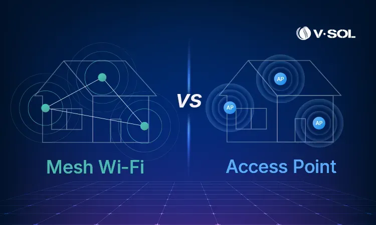
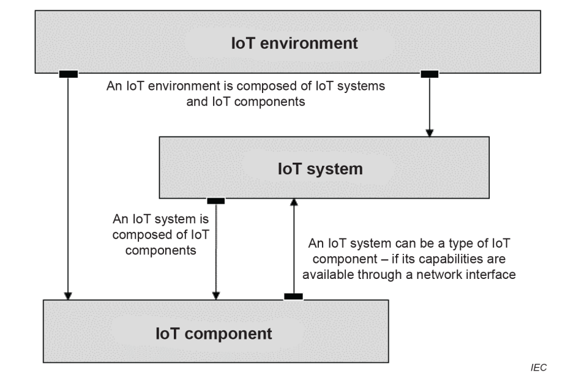
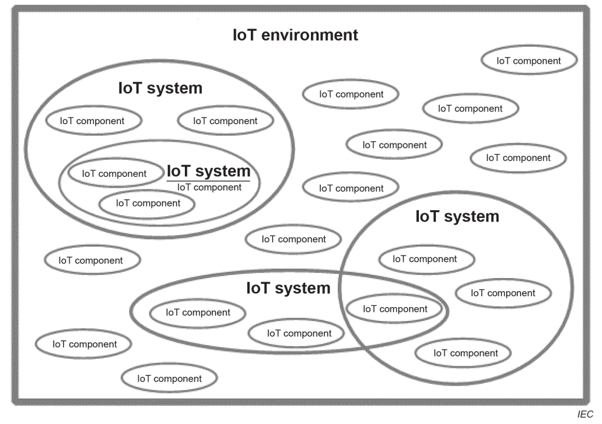
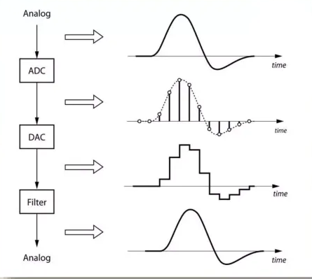
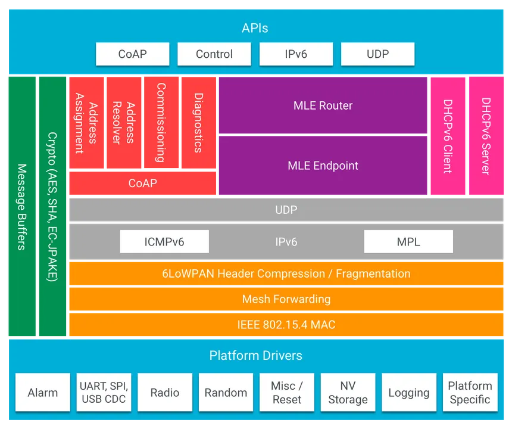
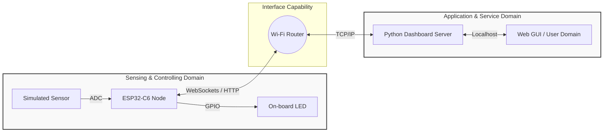
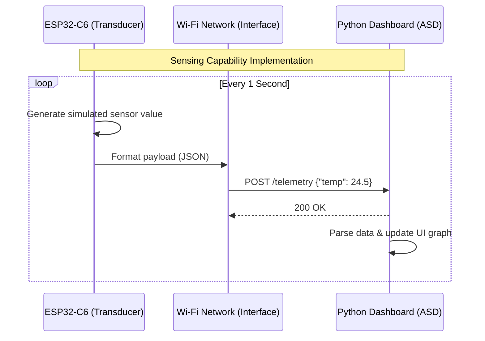
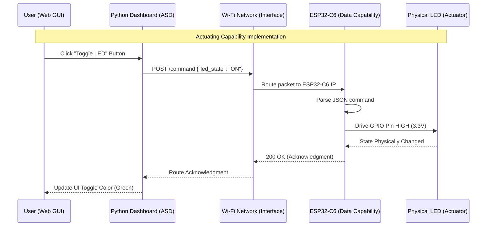

# Lecture 1: Minimal IoT Implementation and Architecture

**Course:** IoT Systems Design
**Target Hardware:** ESP32-C6 (Wi-Fi 6, Bluetooth 5, Zigbee/Thread)
**Target Software:** Python (`lab_http/tools/dashboard_http.py`)
**Standard Reference:** ISO/IEC 30141:2024

---

## Introduction to Lab 0: Minimal IoT Implementation

* **Objective:** To understand the fundamental architectural principles of IoT as defined by **ISO/IEC 30141:2024** and successfully build a minimal IoT system mapping physical hardware to a digital application interface.
* **Core Technologies:** ESP32-C6 Microcontroller, Python, WebSockets/HTTP.

---

## What is an IoT System?
*Defining the Paradigm (ISO/IEC 30141:2024)*

* **The Conceptual Shift:** An embedded device is not inherently an IoT device.
* **1. A Many-to-Many Digital Network:** The system must utilize network capabilities that support routing beyond simple point-to-point connections.
* **2. Physical World Interaction:** The system must possess at least one component that interacts with the physical world through **sensing** or **actuating**.



---

## The IoT Component Pattern
*Deconstructing the Node (§6.7.3)*

* In our lab, the **ESP32-C6** functions as a single **Component**. According to the standard, an IoT Component is defined by five categories of capabilities:
    1. **Transducer Capabilities:** Bridging the physical and digital (Sensing/Actuating).
    2. **Data Capabilities:** Processing, storing, and transferring data locally.
    3. **Interface Capabilities:** Connecting to networks, applications, and human users.
    4. **Supporting Capabilities:** Device management, security, and identity.
    5. **Latent Capabilities:** Potential functions not currently active or provisioned.




---

## Transducer Capabilities: Sensing vs. Actuating
*The Bridge Between Digital and Physical*

* **Sensing Capability:** Acquiring information from the physical world and converting it into a digital representation (Analog-to-Digital).
* **Actuating Capability:** Converting digital commands into physical actions, altering the state of the physical world (Digital-to-Analog / PWM / GPIO).
* **The IoT Core Loop:** The constant interplay between data collection and system response.




---

## Interface Capabilities
*Why a 'Network Interface' is Mandatory*

* **Network Interface Capability:** Dictates how the device connects to the **many-to-many digital network** (e.g., 802.11 Wi-Fi).
* **Application Interface Capability:** How the component exposes its data and services to software (e.g., RESTful APIs, MQTT).
* **Human User Interface Capability:** Direct human interaction (e.g., physical buttons, local displays).



---

## The Architecture of Lab 0
*Mapping the SCD to the ASD*

* **Sensing and Controlling Domain (SCD):** The ESP32-C6 gathering data and executing commands.
* **Application and Service Domain (ASD):** The Python-based dashboard providing logic and visualization.
* **The Goal:** Establish reliable, bidirectional communication.



## Exercise Step 1: Launching the Application Domain
*Running the Dashboard*

**Objective:** Initialize the Application and Service Domain (ASD).

**Action:** Execute python lab_http/tools/dashboard_http.py on your workstation.

**Under the Hood:** Spins up a local server and provisions an Application Interface Capability listening for edge devices.

```bash
~/Documents/4201327-IoT_Systems_Design_Labs/tools$ python3 dashboard_http.py
[*] Dashboard running. Target ESP32 IP: 10.71.203.63
 * Serving Flask app 'dashboard'
 * Debug mode: off
```

## Exercise Step 2: Sensing Implementation
Simulating Telemetry

**Objective:** Implement a Sensing Capability.

**Action:** Flash the ESP32-C6 to transmit continuous dummy data.



## Exercise Step 3: Actuating Implementation
*Closing the Control Loop*

**Objective:** Implement an Actuating Capability.

**Action:** Toggle the on-board LED from the dashboard UI.



## ESP32-C6 Firmware (Zephyr)

The firmware lives in [`firmware/`](firmware/). The Zephyr
application is scaffolded for you; **four pieces are missing and you write them**:

```
firmware/lab0_http/
├── CMakeLists.txt                       # given
├── Kconfig                              # given - Wi-Fi credentials
├── prj.conf                             # TASK 1
├── sections-rom.ld                      # given - linker section for the resources
├── boards/
│   └── esp32c6_devkitc_hpcore.overlay   # given - the on-board RGB LED
└── src/main.c                           # TASKS 2, 3, 4
```

| | What you write | Capability |
|---|---|---|
| **TASK 1** | Four `CONFIG_` symbols in `prj.conf` | all four |
| **TASK 2** | `led_set()` — drive the WS2812 | Actuating |
| **TASK 3** | `sensor_handler()` — build the reading and respond | Sensing + Data |
| **TASK 4** | `control_handler()` — parse the command, actuate, reply | Actuating + Data |

Each spot is marked with a `TASK n` comment in the file, stating what is expected and
how to check it. The build system, the Wi-Fi association code and the HTTP resource
registration are done for you — they are plumbing, not architecture.

Work in order, **TASK 1 first** — the other three need the subsystems it switches on.

A failing build prints a lot; **read the first error, not the last**. If a task is
still outstanding the first line names it:

```
src/main.c:26:2: error: #error "TASK 1 is not done yet: add the four capability
symbols to prj.conf. ..."
```

Errors after that one are consequences of the same cause; fix the named task and they
go together. Once TASK 1 is done the project builds and runs — it just does nothing
yet, which is your baseline. A `'control_cmd_descr' defined but not used` warning is
expected until TASK 4.

### 0. A warning about the "on-board LED"

The C6-DevKitC-1 does **not** have a plain GPIO LED. The single controllable LED is
an **addressable WS2812** on GPIO8, which expects a precise pulse train rather than a
level. Driving it with a GPIO write does nothing visible.

So the LED is a devicetree node driven through the `led_strip` API, declared in
`boards/esp32c6_devkitc_hpcore.overlay`:

```dts
&i2s_default {
	group1 {
		pinmux = <I2S_O_SD_GPIO8>;
	};
};

i2s_led: &i2s {
	status = "okay";
	dmas = <&dma 3>;
	dma-names = "tx";

	led_strip: ws2812@0 {
		compatible = "worldsemi,ws2812-i2s";
		reg = <0>;
		chain-length = <1>;
		color-mapping = <LED_COLOR_ID_GREEN LED_COLOR_ID_RED LED_COLOR_ID_BLUE>;
		reset-delay = <500>;
	};
};
```

This is the first place the Zephyr model shows itself: the *board* description says
which pin the LED is on and how it is driven; `main.c` only asks for
`DT_ALIAS(led_strip)` and sets a colour. Port the application to a board with a plain
GPIO LED and only the overlay changes.

**TASK 2** — in `led_set()`, replace the `TASK 2` comment and the `ARG_UNUSED(on);`
line with:

```c
	struct led_rgb pixel = { .r = 0, .g = 0, .b = 0 };

	if (on) {
		pixel.g = 0x40;
	}

	if (led_strip_update_rgb(strip, &pixel, 1) != 0) {
		LOG_ERR("Failed to drive LED");
	}
```

`strip` is resolved at the top of `main.c` from `DT_ALIAS(led_strip)`. Each channel is
`0x00`–`0xff`; full scale is uncomfortably bright at desk distance, so `0x40` green is
plenty. The `1` is the chain length — one LED on this board.

### 1. Wi-Fi credentials

Wi-Fi credentials are Kconfig symbols declared in the app's own `Kconfig`:

```kconfig
config LAB_WIFI_SSID
	string "Wi-Fi SSID"
	default "changeme"

config LAB_WIFI_PSK
	string "Wi-Fi password"
	default "changeme"
```

Set them for a build without editing tracked files. Run this from the application
directory — the `.` is the app, and it is `lab0_http/`, not `firmware/`:

```bash
source ~/zephyrproject/.venv/bin/activate  # every new terminal needs this
cd lab_http/firmware                  # the directory holding CMakeLists.txt

west build -p always -b esp32c6_devkitc/esp32c6/hpcore . \
  -- -DCONFIG_LAB_WIFI_SSID='"YourNetwork"' -DCONFIG_LAB_WIFI_PSK='"YourPassword"'
```

> The quoting is deliberate: Kconfig string values need their own quotes *inside* the
> shell quotes. `-DCONFIG_LAB_WIFI_SSID=YourNetwork` fails.

> `west: command not found` means the first line was skipped. Install nothing — `west`
> lives in the Zephyr venv, and `apt install west` is an unrelated package.

The ESP32-C6 radio is **2.4 GHz only**. A 5 GHz-only SSID will never associate.

### 2. Which subsystems get built

`prj.conf` selects which subsystems are built in, so every capability in the ISO model
maps to a line here.

**TASK 1** — append to `prj.conf`:

```conf
CONFIG_WIFI=y            # Network Interface Capability
CONFIG_HTTP_SERVER=y     # Application Interface Capability
CONFIG_JSON_LIBRARY=y    # Data Capability
CONFIG_LED_STRIP=y       # Actuating Capability
```

Everything else the project needs — networking, DHCP, the HTTP parser — is already
there. These four are the ones that map one-to-one onto capabilities, which is what
your DDR has to account for.

### 3. Sensing capability — `GET /api/sensor`  ·  TASK 3

Zephyr's HTTP server is declarative: a resource is bound to a service at build time,
and your callback runs when a request arrives. The registration is already written:

```c
HTTP_RESOURCE_DEFINE(sensor_resource, iot_service, "/api/sensor", &sensor_resource_detail);
```

In `sensor_handler()`, replace the `TASK 3` comment and the two `ARG_UNUSED` lines
with:

```c
	if (status != HTTP_SERVER_REQUEST_DATA_FINAL) {
		return 0;
	}

	/* Simulated reading: 20.0 - 29.9 degC */
	uint32_t tenths = 200 + (sys_rand32_get() % 100);
	int len = snprintf(body, sizeof(body), "{\"temperature\": %u.%u}", tenths / 10,
			   tenths % 10);

	LOG_INF("Telemetry requested, sent: %s", body);

	response_ctx->status = HTTP_200_OK;
	response_ctx->headers = headers;
	response_ctx->header_count = ARRAY_SIZE(headers);
	response_ctx->body = body;
	response_ctx->body_len = len;
	response_ctx->final_chunk = true;

	return 0;
```

Two things to understand before you move on, because they generalise well beyond this
lab.

**The callback fires more than once per request.** It runs as the request streams in
and again when it is complete. Only the final call expects a response — that is the
early return. A GET carries no body and *still* gets an earlier callback, so without
that guard the client sees a truncated or empty reply.

**You answer by filling a struct, not by calling a send function.** `status`,
`headers`/`header_count`, `body`/`body_len`, and `final_chunk = true` (you have no
more data). The field is named `temperature` because that is what the dashboard reads.

```bash
curl http://<board-ip>/api/sensor
# {"temperature": 24.7}
```

### 4. Actuating capability — `POST /api/control`  ·  TASK 4

This endpoint receives data, so it has one more trap than TASK 3. Inside the
`if (status == HTTP_SERVER_REQUEST_DATA_FINAL)` block, replace the `TASK 4` comment,
the two `ARG_UNUSED` lines and the `cursor = 0;` with:

```c
		struct control_cmd cmd = { 0 };
		int ret = json_obj_parse(payload, cursor, control_cmd_descr,
					 ARRAY_SIZE(control_cmd_descr), &cmd);

		if (ret == BIT_MASK(ARRAY_SIZE(control_cmd_descr))) {
			LOG_INF("Actuating command received, LED state: %d", cmd.state);
			led_set(cmd.state);
		} else {
			LOG_WRN("Could not parse control payload (ret %d)", ret);
		}

		cursor = 0;

		response_ctx->status = HTTP_200_OK;
		response_ctx->headers = headers;
		response_ctx->header_count = ARRAY_SIZE(headers);
		response_ctx->body = ok_body;
		response_ctx->body_len = sizeof(ok_body) - 1;
		response_ctx->final_chunk = true;
```

**The body can arrive in pieces.** Even a 12-byte payload may be split across
callbacks, which is why the code above the block accumulates into `payload` and only
parses at `..._DATA_FINAL`. Read that accumulation — skipping this pattern produces a
parser that works on your desk and fails on a loaded network.

**`json_obj_parse()` does not return 0 on success.** It returns a *bitmask*, one bit
per field it filled, so success is `ret == BIT_MASK(ARRAY_SIZE(control_cmd_descr))`.
Treating a non-zero return as an error is the usual bug here.

```bash
curl -X POST http://<board-ip>/api/control \
     -H 'Content-Type: application/json' -d '{"state": 1}'
# {"status": "ok"}   and the LED turns green
```

### 5. The linker section

Each `HTTP_SERVICE_DEFINE` needs a matching iterable ROM section or the resource list
does not link:

```
/* sections-rom.ld */
ITERABLE_SECTION_ROM(http_resource_desc_iot_service, Z_LINK_ITERABLE_SUBALIGN)
```

```cmake
zephyr_linker_sources(SECTIONS sections-rom.ld)
zephyr_linker_section(NAME http_resource_desc_iot_service
  KVMA RAM_REGION GROUP RODATA_REGION)
```

The section name must be `http_resource_desc_<service name>`. Rename the service in
`HTTP_SERVICE_DEFINE` and you must rename the section too, or you get
`undefined reference to _http_resource_desc_..._list_start` at link time.

---

## System Integration & Verification

### Step 1: Build and flash

```bash
source ~/zephyrproject/.venv/bin/activate
cd lab_http/firmware

west build -p always -b esp32c6_devkitc/esp32c6/hpcore . \
  -- -DCONFIG_LAB_WIFI_SSID='"YourNetwork"' -DCONFIG_LAB_WIFI_PSK='"YourPassword"'
west flash
```

### Step 2: Read the node's IP address

Open the console **on the UART port** (`/dev/ttyUSB0`) and reset the board:

```bash
west espressif monitor -p /dev/ttyUSB0
```

```
[00:00:03.412] <inf> lab0_http: Connecting to "YourNetwork"...
[00:00:05.220] <inf> lab0_http: Associated with "YourNetwork"
[00:00:06.918] <inf> lab0_http: IPv4 address: 192.168.1.100
[00:00:06.925] <inf> lab0_http: HTTP server listening on port 80
```

Confirm the node answers before involving the dashboard:

```bash
curl http://192.168.1.100/api/sensor
# {"temperature": 24.7}

curl -X POST http://192.168.1.100/api/control \
     -H 'Content-Type: application/json' -d '{"state": 1}'
# {"status": "ok"}
```

The LED should turn green on the second command. If `curl` works and the dashboard
does not, the problem is in the dashboard's `ESP32_IP`, not the firmware.

### Step 3: Launch the Application Domain

Put the address from step 2 into `lab_http/tools/dashboard_http.py`:

```python
# --- Network Configuration ---
ESP32_IP = "192.168.1.100"  # <-- Update this!
```

```bash
python3 lab_http/tools/dashboard_http.py
```

Open `http://localhost:5000`.

### Step 4: Verify both capabilities

- **Sensing:** the "Live Telemetry" graph gains a point every 1.5 s and the status
  reads "Connected. Live data stream active."
- **Actuating:** "Turn ON" / "Turn OFF" changes the on-board RGB LED, and each POST
  is logged on the serial console.

### When something breaks

| Symptom | Cause |
|---|---|
| `Wi-Fi association failed` | Wrong PSK, or a 5 GHz-only SSID — the C6 is 2.4 GHz only |
| Boots, no `IPv4 address` line | Associated but no DHCP lease; check the AP's DHCP pool |
| Console silent, board flashes fine | You are on `/dev/ttyACM0`; the console is on the UART port |
| `curl` times out | Node and workstation are on different subnets, or AP client isolation is on |
| LED never lights | Overlay missing from the build — confirm `boards/` sits next to `CMakeLists.txt` |
| `undefined reference to _http_resource_desc_*` | Linker section name does not match the service name |
